# Chapter02. 운영체제의 소개
## 01. 운영체제의 개념과 발전 목적
### 1) 운영체제의 개념
   컴퓨터 시스템 : 사용자, 소프트웨어, 하드웨어로 구성됨.
   
운영체제 : 사용자가 하드웨어에 접근할 수 있는 유일한 수단
- 사용자가 응용 프로그램을 실행할 수 있는 기반 환경을 제공
- 하드웨어, 컴퓨터 자원을 효율적으로 사용할 수 있도록 다양한 기능(관리 및 조정)을 제공하는 소프트웨어

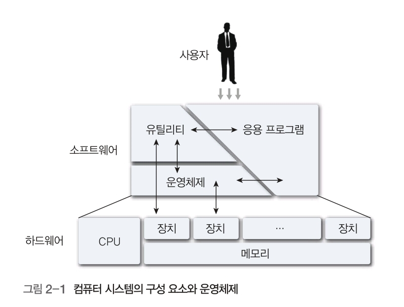

  사용자 : 어떤 일(작업)을 수행하려고 컴퓨터를 사용하는 사람이나 장치, 다른 컴퓨터
  
소프트웨어 : 컴퓨터가 기능을 수행하는 데 필요한 모든 프로그램.
- 시스템 소프트웨어, 유틸리티, 응용 프로그램 등으로 구성됨

  시스템 소프트웨어 : 컴퓨터 자원을 관리하고 응용 프로그램의 실행을 지원하여 컴퓨터를 제어하는 프로그램. 운영체제와 장치 드라이버 등으로 구성됨.

- 응용 프로그램 : 특정 작업을 수행하려는 목적, 즉 어떤 문제를 해결하려고 사용자나 전문가가 만든 프로그램.

하드웨어 : 기본 연산 자원을 제공하는 프로세서(CPU), 메모리, 주변장치 등으로 구성됨

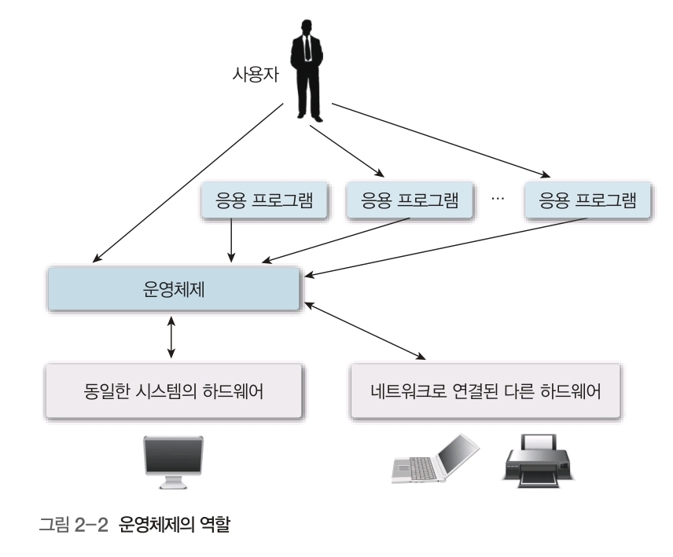

##### 운영체제의 역할
- 조정자 : 운영 요소를 적절하게 사용할 수 있도록 제어하면서 사용자와 응용 프로그램 간에 통신하며 작업을 할 수 있는 환경을 제공함
- 자원 할당자나 관리자 : 각 응용 프로그램에 필요한 자원을 할당함.
- 응용 프로그램과 입출력장치 제어자 : 다양한 입출력장치와 응용 프로그램을 제어함.

하드웨어 및 사용자, 응용 프로그램, 시스템 프로그램 사이에서 인터페이스 제공

프로세서, 메모리, 입출력장치, 통신장치 등 컴퓨터 자원을 효과적으로 활용하려고 조정, 관리함

메일 전송, 파일 시스템 검사, 서버 작업 등 높은 수준의 서비스를 처리하는 응용 프로그램을 제어함

다양한 사용자에게서 컴퓨터 시스템을 보호하려고 입출력을 제어하면서 데이터를 관리함.

운영체제는 커널, 장치 드라이버, 사용자 인터페이스, 시스템 유틸리티 등으로 구분됨.

### 2) 운영체제의 발전 목적

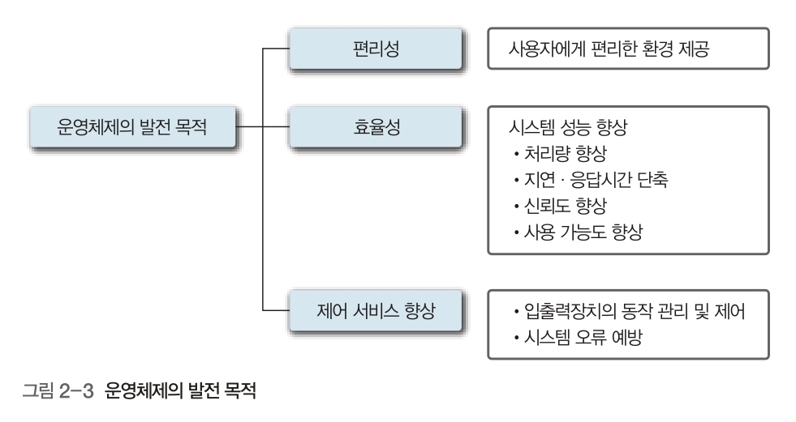

##### 운영체제의 발전 목적
- 편리성 : 사용자에게 편리한 환경 제공
- 효율성 : 시스템 성능(처리량, 지연 응답시간 단축, 신뢰도, 사용 가능도) 향상.
- 처리량 : 시스템의 생산성을 나타내는 지표. 단위 시간 당 처리하는 작업량
- 지연 응답시간 : 작업을 의뢰한 후 반응을 얻을 때까지 걸린 시간
- 신뢰도 : 하드웨어, 소프트웨어가 실패 없이 주어진 기능을 수행할 수 있는 능력
- 사용 가능도 : 가동률. 사용자가 일정 기간 동안 컴퓨터를 실제로 이용한 시간.
- 제어 서비스 향상 : 입출력장치 동작 관리 및 제어, 시스템 오류 예방

## 02. 운영체제의 기능

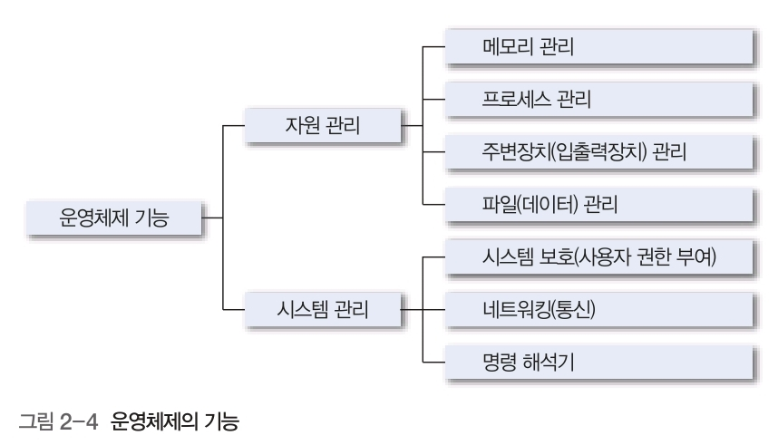

### 1) 자원 관리

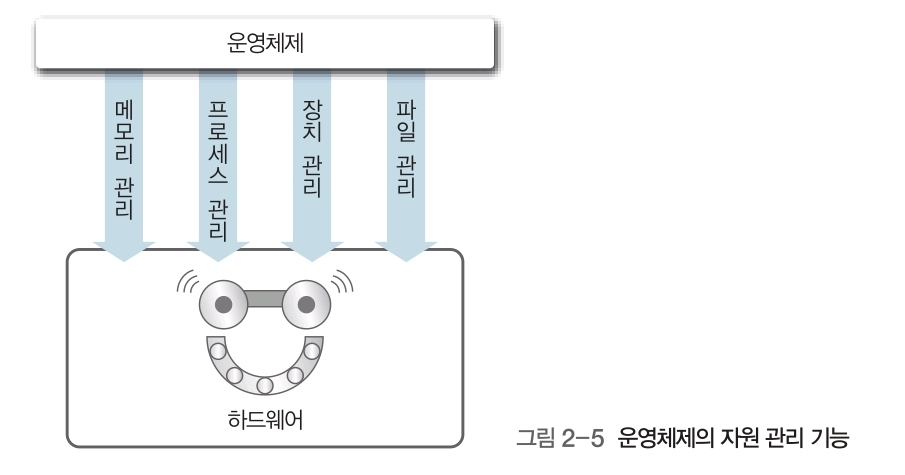

   자원 : 컴퓨터 시스템의 메모리, 프로세스, 장치, 파일 등 구성 요소
#### 1.1)	메모리 관리
- 메인 메모리 관리 : 메모리의 어느 부분을 사용하고 누가 사용하는 지 점검, 메모리에 저장할 프로세스를 결정, 메모리를 할당하고 회수하는 방법을 결정.
- 보조기억장치 관리 : 빈 여유 공간 관리, 새로운 파일을 작성할 때 저장 장소를 할당, 메모리 접근 요청을 스케줄링, 파일을 생성하고 삭제
#### 1.2)	프로세스 관리
프로세스 : 실행 중인 프로그램. 보통 일괄 처리 작업 하나. 시분할 사용자 프로그램, 스풀링과 같은 시스템 작업이 하나의 프로세스.

하나의 프로세스는 프로세서, 메모리, 파일, 입출력장치와 같은 자원이 있어야 업무 수행 가능.

자원은 프로세스를 생성할 때 제공하거나 실행 중에 할당 가능.

시스템 : 프로세스의 집합. 크게 시스템 코트를 수행하는 운영체제 프로세스와 사용자 코드를 수행하는 사용자 프로세스로 구분됨.

모든 프로세스는 프로세서를 분할 사용하여 병행 수행할 수 있음.

##### 운영체제가 프로세스를 관리하는 법
- 프로세스와 스레드를 스케줄링
- 사용자 프로세스와 시스템 프로세스를 생성하고 제거
- 프로세스를 중지하고 재수행
- 프로세스 동기화 방법을 제공
- 프로세스 통신 방법을 제공
- 교착 상태(deadlock)를 방지하는 방법을 제공

#### 1.3)	주변장치(입출력장치) 관리
운영체제는 특수 프로그램인 장치 드라이브를 사용하여 입출력장치와 상호작용함.

장치 드라이버 : 특정 하드웨어 장치와 통신할 수 있는 인터페이스를 제공. 특정 하드웨어에 종속된 프로그램.

##### 운영체제가 주변장치를 관리하는 법
- 임시 저장(buffer-caching) 시스템 기능 제공
- 일반 장치용 드라이버 인터페이스를 제공
- 특정 장치 드라이버를 제공
#### 1.4) 파일(데이터) 관리
  파일 관리 : 입출력 파일의 위치, 저장과 검색 관리를 의미함.

  운영체제는 단일화된 저장 형태를 제공함. 다수의 사용자가 접근할 때 접근 제어를 함.
- 파일 생성 및 삭제
- 디렉토리 생성 및 삭제
- 보조기억장치에 있는 파일을 매핑
- 안전한(비휘발성) 저장장치에 파일을 저장

### 2) 시스템 관리
#### 2.1) 시스템 보호(사용자 권한 부여)
   시스템 보호 : 컴퓨터 자원에서 프로그램, 프로세스, 사용자의 접근을 제어하는 방법

   파일 사용 권한 부여, 데이터 암호화 등 서비스를 제공하여 데이터와 시스템을 보안함.
#### 2.2) 네트워크(통신)
   완전 접속과 부분 접속 방법으로 연결함. 연결된 프로세서가 통신을 할 때에는 경로 설정, 접속 정책, 충돌, 보안 등 문제를 운영체제가 관리함.
#### 2.3) 명령 해석기(command interpreter)
   명령 해석기 : 시스템 프로그램. 사용자나 프로그램에서 대화형으로 입력한 명령어를 이해하고 실향하는 사용자와 운영체제의 인터페이스. 명령 해석기는 인터페이스이고 운영체제는 아님.

   명령 해석기와 커널을 분리하면 명령 해석기의 인터페이스를 변경할 수 있음.

## 03. 운영체제의 발전과정과 유형
### 01) 운영체제의 발전 과정

##### 일괄(fetch) 처리 : 직렬 처리 기술과 동일함. 오퍼레이터에서 비슷한 작업들을 묶어 일괄 처리함. 데이터가 발생할 때마다 바로 실행하지 않고, 일정량이 될 때까지 기다렸다가 처리함,

준비 작업들의 유형들이 동일해야 하고, 작업에 모든 유형의 입력을 할 수 없음.
- 많은 사용자와 프로그램이 컴퓨터 자원을 공유할 수 있음.
- 컴퓨터 자원을 덜 사용 중일 때는 작업 처리 시간을 교대할 수 있음.
- 시시각각 수동으로 개입하고 감독하여 컴퓨터 자원의 유휴를 피할 수 있음.

  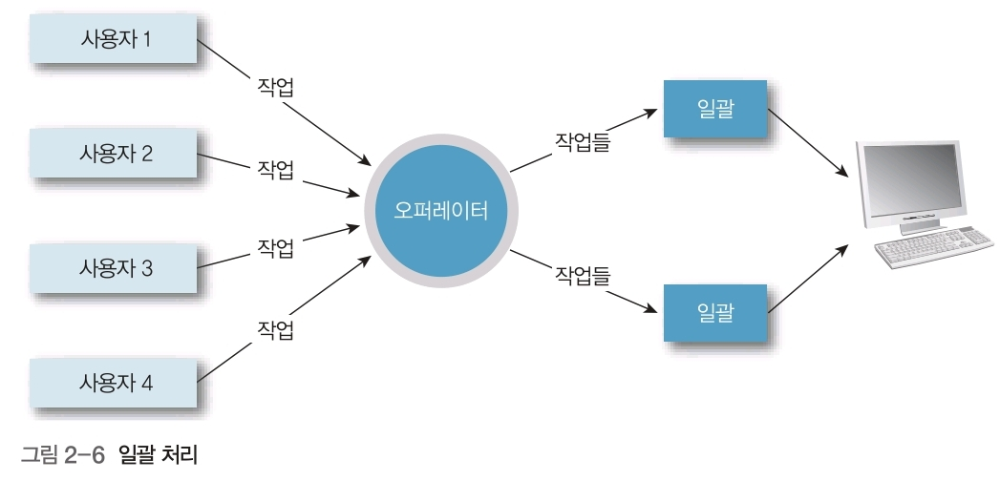

  버퍼링(buffering) : 프로세서와 입출력장치의 속도 차이로 생긴 유휴시간이 없도록 입출력장치 별로 입출력 버퍼를 두어, 프로세서에서 연산을 할 때 동시에 다른 작업을 입출력하는 방법.

  버퍼 : 프로세서가 어떤 작업을 처리하는 동안 버퍼에 다음으로 처리할(또는 출력할) 작업을 미리 읽어 저장해 두는 메모리

  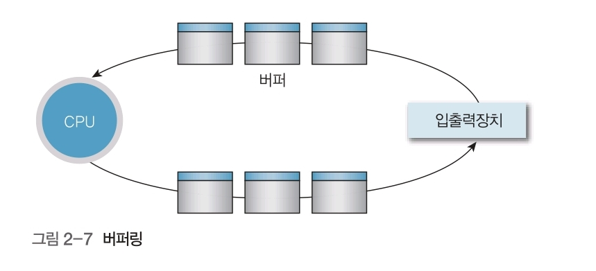

  스풀링(spooling : simultaneous peripheral operation on-line) : 속도가 빠른 디스크를 버퍼처럼 사용하여 입출력장치에서 미리 읽는 것. 스풀링은 버퍼와 달리 여러 작업의 입출력과 계산을 함께 할 수 있음. 프로세서와 입출력 중심 작업이 혼합된 경우에 더 좋음

  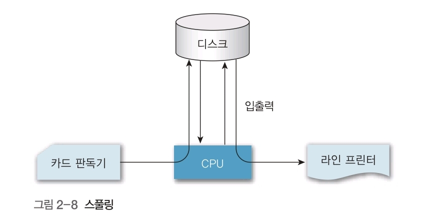

### 02) 운영체제의 유형

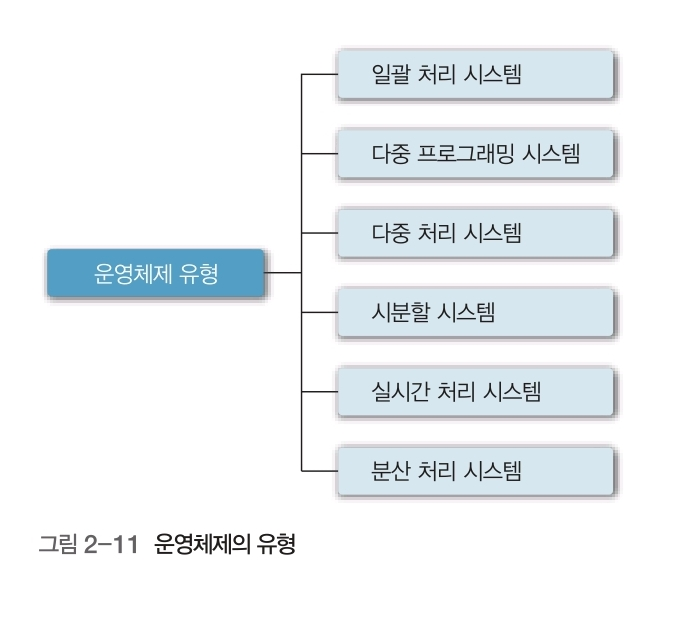

##### 단일 작업(Single tasking) 운영체제 : 한 번에 하나의 프로그램만 수행할 수 있는 프로그램(DOS)
#### 2.1) 다중 프로그래밍 시스템 : 여러 프로그램을 메모리에 적재한 후 하나의 프로그램이 프로세서를 사용하다가 입출력 동작 등을 하여 프로세서를 사용하지 않는 유휴 시간(idle time) 동안 다른 프로그램이 프로세서를 사용하도록 전환(인터리빙) 하는 시스템. 따라서 매우 복잡함.

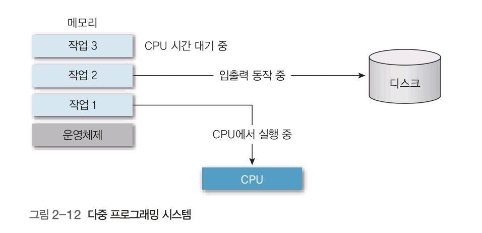

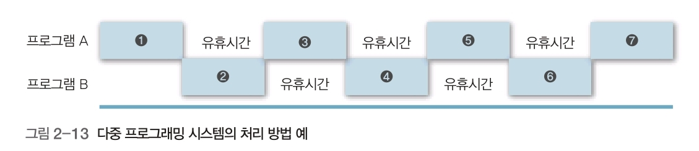

#### 2.2) 시분할 시스템(Time Sharing System) : 각 프로그램에 일정한 프로세서 사용 시간 또는 규정 시간량을 할당하여 사용자가 주어진 시간 동안 컴퓨터와 대화하는 형식. 메모리에 여러 프로그램을 적재하므로 메모리를 관리해야 함. 스케줄링 개념이 필요함. 다중 프로그래밍 시스템은 프로세서 사용을 최대화하는 것을 목표로 하고 시분할 시스템은 응답시간 최소화를 목표로 함.

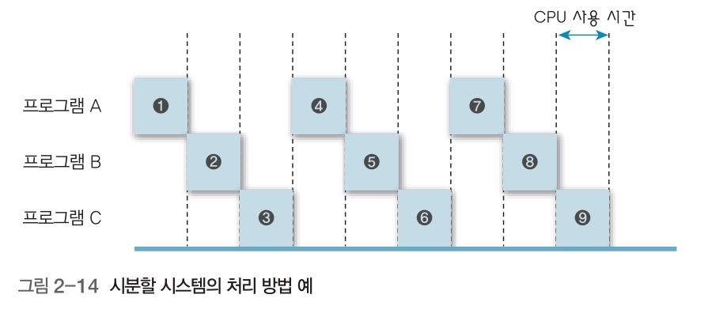

##### 시분할 시스템 장점
- 빠른 응답시간 제공, 소프트웨어의 중복 회피 기능, 프로세서 유휴시간 감소
##### 시분할 시스템 단점
- 신뢰성 문제, 보안 의문 및 사용자 프로그램과 데이터의 무결성, 데이터 통신의 문제
#### 2.3) 다중 처리 시스템(multiprocessing system)

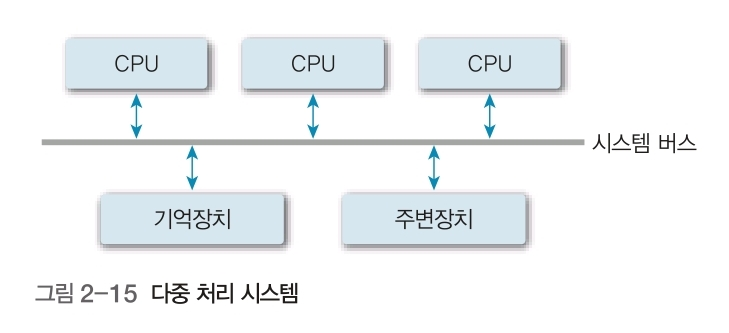

  단일 컴퓨터 시스템 내에서 둘 이상의 프로세서를 사용하여 동시에 둘 이상의 프로세스(프로그램)을 지원. 프로세서가 여러 개 있다는 것이 특징. 여러 프로세서가 시스템 버스, 클록, 메모리와 주변장치 등을 공유. 프로세서 간의 연결, 상호작용 역할 분담 등을 고려해야 함.
#### 2.4) 실시간 처리 시스템(real time processing system)

  데이터 처리 시스템. 입력에 응답하는데 필요한 시간 간격이 매우 짧음. 항상 온라인 상태여야 하며, 입력 및 업데이트된 정보 요구를 처리한 후 디스플레이에 응답하는 시스템에 소요되는 반응 시간으로 한다. 고정 시간 제약을 잘 설정하지 않으면 시스템이 실패함.
- 경성 실시간 처리 시스템(hard real time processing system) : 시간 제약 조건을 지키지 못할 때 시스템에 치명적인 영향을 주는 시스템.
- 연성 실시간 처리 시스템(soft real time processing system) : 시간 제약 조건을 지키지 못해도 전체 시스템에 영향을 주지 않는 시스템.
#### 2.5) 분산 처리 시스템(distributed processing system)

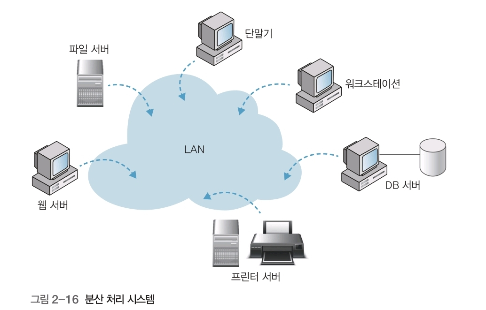

  독립적인 운영체제와 메모리로 운영하며, 필요할 때 통신하는 시스템.  다수의 독립된 프로세서에서 실행, 데이터를 처리, 저장하며 여러 사용자가 공유할 수 있음. 하나의 프로그램을 여러 프로세서에서 동시에 실행할 수 있음.

## 04. 운영체제의 서비스
### 1) 부팅 서비스 : 컴퓨터 하드웨어를 관리하고 프로그램을 실행할 수 있도록 컴퓨터에 시동을 검.
부팅(booting) : 부트스트래핑(bootstrapping). 운영체제를 메인 메모리에 적재하는 과정.
   
부트 로더(bootstrap loader) : 하드디스크와 같은 보조기억장치에 저장된 운영체제를 메인 메모리에 적재하는 ROM에 고정시킨 소규모 프로그램.

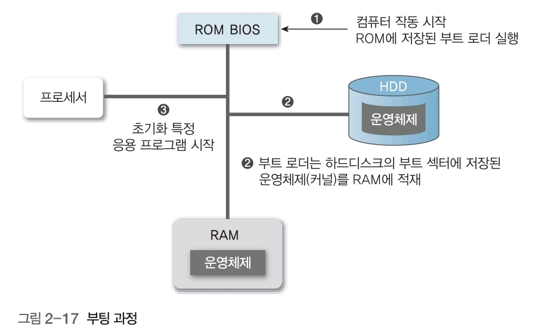

### 2) 사용자 서비스 : 프로그래머가 프로그래밍 작업을 쉽게 수행할 수 있도록 함.
#### 2.1) 사용자 인터페이스 제공 : 사용자와 컴퓨터 간에 상호작용이 발생하는 공간 제공
- CLI(Command Line Interface : 명령 라인 인터페이스) : 사용자가 키보드 등으로 프롬프트에서 명령어를 입력하여 시스템에서 응답을 받은 후 동작하게 하는 텍스트 전용 인터페이스.
- 프롬프트 : 컴퓨터가 입력을 기다리고 있음을 가리키려고 화면에 나타나는 표시
- 메뉴 인터페이스 : 메뉴 등을 사용하여 시스템과 상호작용함. 사용이 편리함.
- GUI(Graphical User Interface : 그래픽 사용자 인터페이스)
#### 2.2) 프로그램 실행 : 프로그램을 실행하기 위한 메모리 할당, 해제, 프로레서 스케줄링 등 작업 처리
#### 2.3) 입출력 동작 수행 : 입출력 동작을 직접 수행할 수 없는 사용자 프로그램의 입출력 동작 방법을 제공
#### 2.4) 파일 시스템 조작 : 파일 시스템 조작 서비스를 제공하여 사용자가 열기, 저장, 삭제 등 파일 관련 작업을 쉽게 할 수 있도록 함.
#### 2.5) 통신(네트워크) : 다중 작업 환경에서 공유 메모리를 이용하거나 메시지 전달로 다양한 유형의 프로세스와 통신을 지원함.
#### 2.6) 오류 탐지 : 운영체제는 오류 유형을 감지 후 유형별로 적절히 조치함
- 프로세서, 메모리 하드웨어와 관련된 오류 : 기억장치 메모리 오류, 정전
- 입출력장치 오류 : 테이프의 패리티 오류, 카드 판독기의 카드 체증, 프린터의 종이 부족
- 사용자 프로그램 오류 : 연산의 오버플로, 부적당한 기억장치 장소 접근, 프로세서 시간을 지나치게 많이 사용
### 3) 시스템 서비스 : 시스템의 효율적인 동작을 보장함.
#### 3.1) 자원 할당 : 프로세서 사이클, 메인 메모리, 파일 저장 장치 등의 자원을 관리함.
#### 3.2) 계정 : 각 사용자가 어떤 컴퓨터 자원을 많이 사용하는지 정보를 저장하고 추적함.
#### 3.3) 보호와 보안 : 다중 사용자 컴퓨터 시스템에 저장된 정보 소유자의 사용을 제한할 수 있음.
- 보호 : 시스템 호출을 하려고 전달한 모든 매개변수의 타당성을 검사하고 시스템 자원에 모든 사용자 접근을 제어하도록 보장하는 것.
- 보안 : 잘못된 접근 시도에서 외부 입출력장치를 방어하며, 외부에 사용자 인증을 요구하는 것.
### 4) 시스템 호출 : 프로그램이 운영체제의 기능을 서비스받을 수 있는 프로그램과 운영체제 간의 인터페이스. API(Application Programming Interfaces). 응용 프로그램이 사용자 수준에서 지원하지 않는 기능을 운영체제의 루틴을 호출하여 제공받는 방법.
   시스템 호출에는 핵심 커널 서비스와 통신, 새로운 프로세스의 생성과 실행, 하드웨어 관련 서비스 존재.

##### 시스템 호출 방법
- 프로그램에서 명령이나 서브루틴의 호출 형태로 호출하는 방법.
- 시스템에서 명령 해석기를 사용하여 대화 형태로 호출하는 방법.

  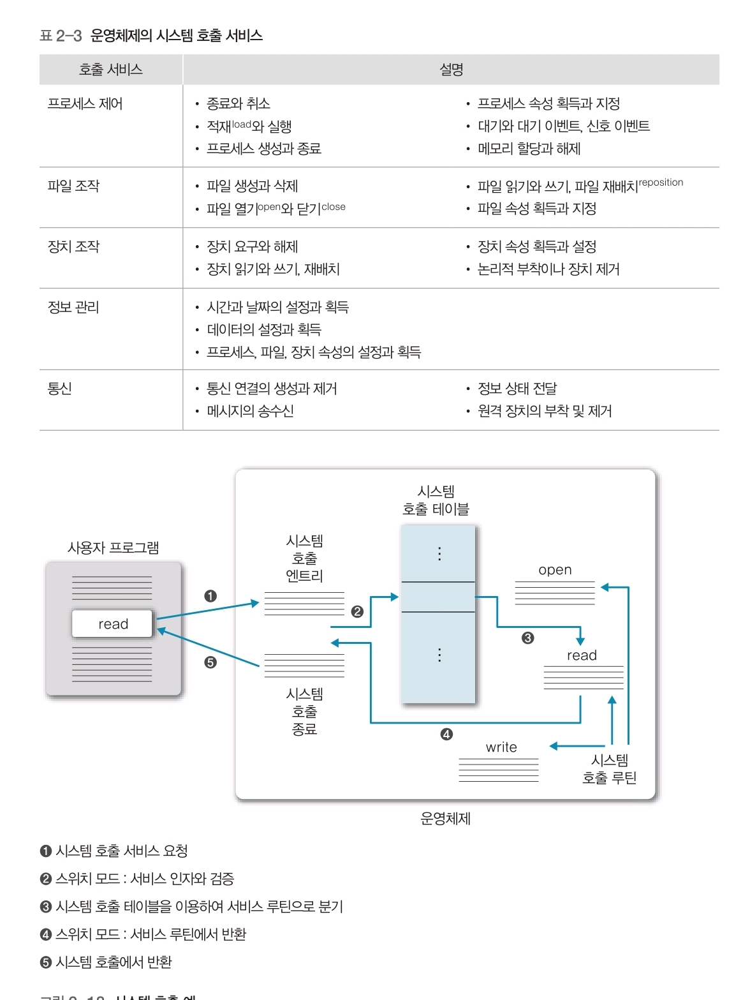

## 05. 운영체제의 구조
### 1) 단일(monolithic) 구조 운영체제
   운영체제의 모든 기능을 커널과 동일한 메모리 공간에 적재한 후 시스템 호출만으로 사용할 수 있음. 작고 간단하면서 시스템 기능이 제한된 구조.
   
대부분의 기능을 커널에 그룹화해서 구현하므로, 직접 통신하여 시스템 자원을 효율적으로 관리할 수 있다는 장점이 있음.

   그러나 커널 크기가 상대적으로 커져 버그의 원인이나 기타 오류를 구분하기 어렵고, 새 기능을 추가하는 수정과 유지보수가 어려움.

   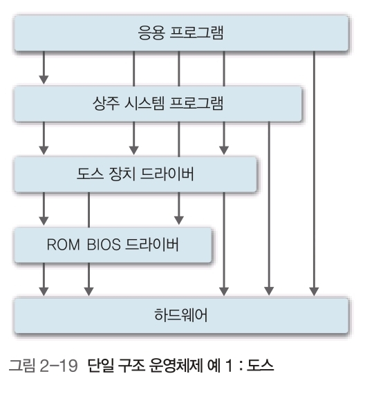

   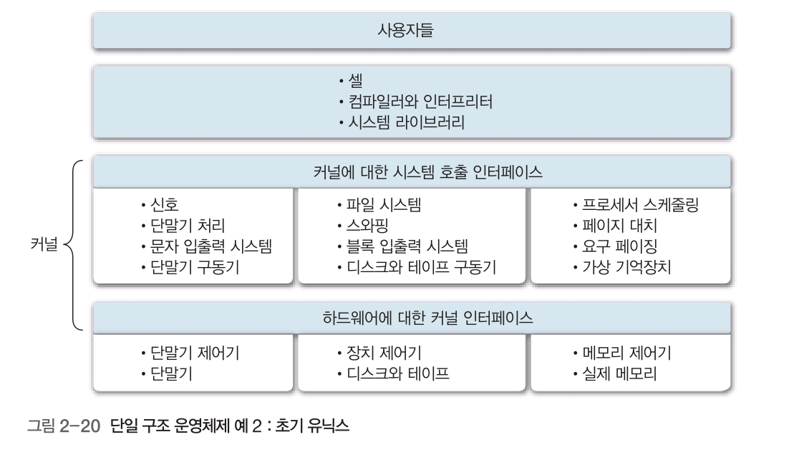

   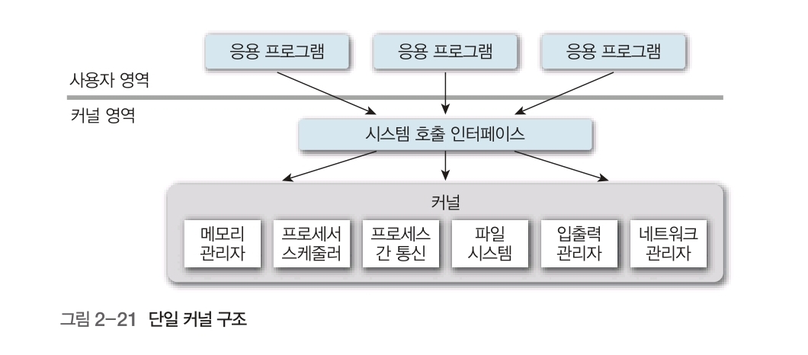

### 2) 계층 구조 운영체제
   비슷한 기능을 수행하는 요소를 그룹화하여 계층적으로 구성함.

   최하층 계층(계층 0)인 하드웨어에서 최상위 계층(계층 5)인 사용자 인터페이스까지 다수의 계층(수준)으로 구성됨. 단일 구조보다는 성능이 떨어짐. 계층 별 시스템 검증과 오류 수정이 쉬움.

   각 계층은 자기 하위 계층만 사용할 수 있으므로 설계가 중요함.

   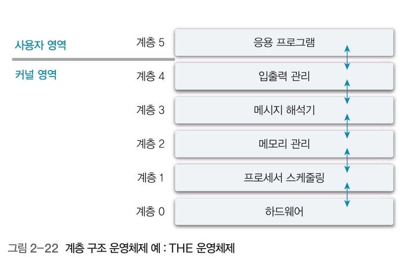

### 3) 마이크로 커널 구조 운영체제
   마이크로 커널 구조는 커널의 기능을 많이 축소하고 기타 기능은 사용자 영역에서 수행하는 서버 구현 방법.

   마이크로 커널 구조에서는 하드웨어 초기화와 메모리 관리(주소 공간 관리), 프로세스(스레드) 관리와 프로세스 간 통신, 프로세스 간 협력을 하는 동기화 기능 등 기본 기능만 실행함.

   대신 네트워크 시스템, 파일 시스템 상호작용과 장치 관리 등 대부분의 운영체제 구성 요소는 커널 외부, 즉 사용자 영역의 서버로 옮겨 구현함.

   커널이 가벼워지고 운영체제 서비스를 사용자 영역의 독립적인 서버에서 수행하기 때문에 서버에서 잘못 수행하더라도 다른 서버와 커널에 치명적인 영향을 주지 않는다. 또 운영체제의 많은 기능을 사용자 영역의 서버로 구현할 수 있기 때문에 서버 개발이 용이하고, 운영체제의 기능을 쉽게 변경할 수 있음.

   모듈화 정도가 높아 확장성, 이식성, 규모 확장성이 높지만 모듈 간에 통신이 빈번하게 발생하여 성능이 떨어질 수 있음. 따라서 프로세스 간 통신 발생을 최소화시키는 것이 중요 과제임.

   커널 내부에서 발생 지연이 적고 예측 가능하여 실시간 시스템에서 활용함.

   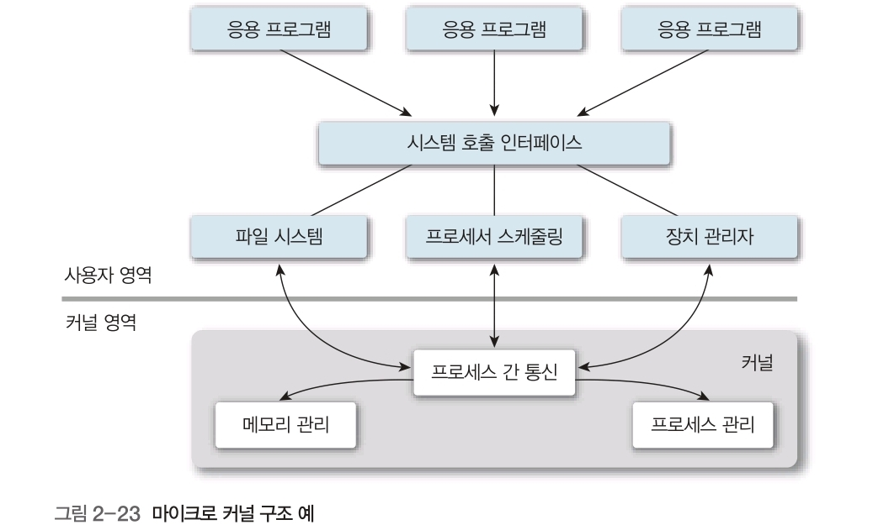
